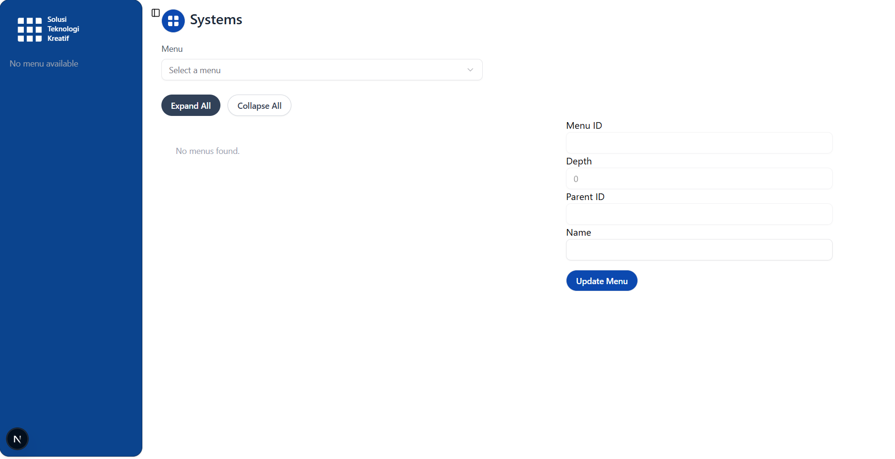

# Frontend (Next.js)

Folder ini berisi aplikasi frontend untuk proyek — sebuah aplikasi Next.js 16 yang dibangun dengan React 19.

README ini menjelaskan isi frontend dan langkah-langkah untuk men-setup serta menjalankannya secara lokal di Windows (PowerShell) atau platform lain.

## Ringkasan singkat

- Framework: Next.js 16
- UI: React 19
- Styling: Tailwind CSS (v4) dengan beberapa variabel CSS kustom di `app/globals.css`
- Paket ikon: `lucide-react`
- Komponen penting: sidebar aplikasi berada di `components/app-sidebar.tsx` dan primitive UI untuk sidebar berada di `components/ui/sidebar.tsx`.

## Prasyarat

- Node.js (disarankan 18.x atau lebih baru)
- npm (atau yarn/pnpm jika kamu lebih suka; perintah di bawah menggunakan npm)

Cek versi Node dan npm:

```powershell
node -v
npm -v
```

````

## Instalasi dependensi

Dari folder `frontend` jalankan:

```powershell
npm install
```

## Menjalankan server pengembangan

Jalankan Next.js dalam mode dev (hot reload aktif):

```powershell
npm run dev
```

Buka http://localhost:3000 di browser

## Build untuk produksi

Untuk membuat bundle produksi:

```powershell
npm run build
```

Untuk menjalankan server produksi yang sudah dibuild secara lokal:

```powershell
npm run start
```

## Linting

Jalankan ESLint (proyek menggunakan ESLint):

```powershell
npm run lint
```
````
